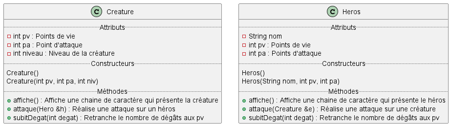
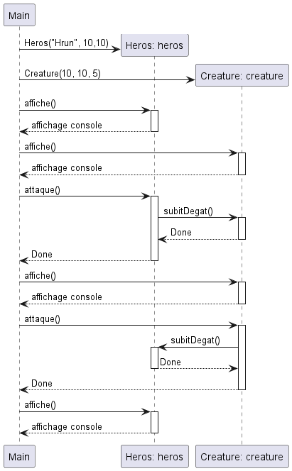

# POO-WS-inheritance

> L'objectif de ce WS est de reprendre le jeu vidéo CESI & Dragons que nous avons commencé à développer dans le [WS n°1](https://github.com/quentinl-c) et d'utiliser l'héritage et le polymorphisme pour implémenter de nouvelles fonctionnalités et mieux structurer nos classes...
>
> Nous aborderons également, la notions d'appels asynchrones et de pointeurs de fonction.

## Previously dans CESI & Dragons

À partir de diagrammes UML, vous deviez proposer une première version d'un jeu vidéo permettant à des Héros et de Créatures de s'affronter sans merci.

## 1. Les personnages

1.1 Quel problème constatez-vous avec la première conception des classes `Heros` et `Creature` ?

1.2 Proposez une classe `Personnage` et utilisez l'héritage pour répondre au problème soulevé :

* Faites un diagramme UML
* Écrire le code associé

1.3 Définissez de nouveaux types de personnage (avec de nouvelles propriétés) qui héritent de `Heros` et `Creature` : Magicien, Guerrie, Demon ...

## 2. Les objets

Sur le même principe que les personnages, définissez une classe `Objet` et un ensemble de classes filles, ex : Potion, Arme, Vetement ...

(On peut imaginer que tous les objets ont au moins un attribut prix en commun, par exemple ...)

## 3. Le sac d'objets

Tous les `Heros` ont de ça en commun qu'ils ont tous une sacoche qui conserve un ensemble d'objets ...

Vous pouvez imaginer dans un premier temps une solution à base de tableaux de pointeurs (n'oubliez pas que votre solution doit permettre le polymorphisme)

## 4. Attaques spéciales et guérison de télépathie

Dans cette partie, nous nous intéresseront aux magiciens et aux créatures : 

### 4.1 Attaques spéciales

Les Magiciens sont dotés de pouvoirs très puissants. Ils peuvent par exemple infliger des dégâts critiques à leurs ennemis, rien qu'en incantant des formules magiques très anciennes.

Dans la classe `Magicien`, définissez une méthode `attaqueSpeciale(Creature&)`, cette attaque va infliger un nombre de dégâts très important.

Vous utiliserez un pointeur vers la méthode `subitDegats(int)` de la classe ` Creature` . Ainsi, la classe  `Magicien `connaît la signature de la méthode et la classe `Creature` peut implémenter plusieurs méthodes avec cette même signature (ex : `subitDegatsCrtitiques(int)`).
